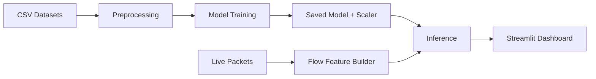

# Real-Time AI Intrusion Detection System (RT-AI IDS)

Production-grade pipeline for training on benchmark IDS datasets and detecting live intrusions with a real-time dashboard.

## Why this project matters
Modern networks face fast, noisy attacks that change faster than static rules. This project demonstrates how data science and real-time engineering can be combined to build a deployable IDS that learns from historic traffic and scores live flows with low latency.

## Highlights
- End-to-end ML pipeline: data ingestion, label mapping, feature engineering, scaling, and training.
- Imbalance handling with SMOTE (when available) for better minority-class learning.
- Real-time flow feature extraction from live packets.
- Streamlit dashboard for threat visibility and alert tracking.

## Tech stack
Python, Scapy, TensorFlow, Streamlit, Pandas, Scikit-Learn, Imbalanced-Learn

## Datasets
- CICIDS2017
- NSL-KDD

The preprocessor auto-detects CICIDS2017 CSVs and can switch to NSL-KDD explicitly.

## Architecture


## Model
- Dense MLP: 128 -> 64 -> 32
- BatchNorm + Dropout
- Softmax output for multi-class classification
- Class weighting + early stopping + LR reduction

## Local results (example)
See models/training_metrics.json for current metrics.

## How to run
### 1) Create a virtual environment
```bash
python -m venv .venv
# Windows
.venv\Scripts\activate
# macOS/Linux
source .venv/bin/activate
```

### 2) Install dependencies
```bash
pip install -r requirements.txt
```

### 3) Preprocess data
```bash
python src/preprocessor.py --data-dir . --profile auto --include-benign --output-dir models
```

### 4) Train model
```bash
python src/train.py --data-dir . --profile auto --include-benign --model-dir models
```

### 5) Run dashboard
```bash
streamlit run ui/app.py
```
Open http://localhost:8501

## Live capture note (Windows)
Install Npcap to enable Scapy packet capture. Without it, live sniffing is disabled.

## Project structure
- setup.py: creates /src, /models, /ui
- src/preprocessor.py: data loading, SMOTE, scaling, label mapping
- src/train.py: model training and artifact saving
- src/sniffer.py: packet capture, flow features, inference
- ui/app.py: Streamlit dashboard

## Responsible use
This project is for defensive research, monitoring, and education. Use only on networks you own or have permission to test.

## Roadmap
- Drift monitoring and recalibration
- Containerized deployment
- Expanded dataset support
