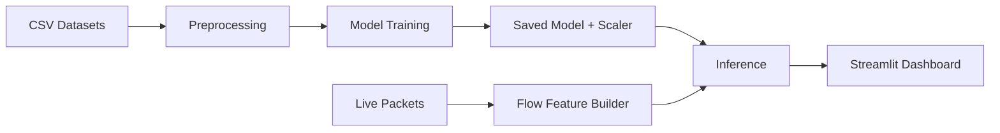

# 🚀 Real-Time AI Intrusion Detection System (RT-AI IDS)

### AI-Powered Cybersecurity Solution for Real-Time Network Threat Detection

A machine learning and deep learning based Intrusion Detection System (IDS) that monitors live network traffic, extracts flow-based features, and classifies cyber attacks in real time using TensorFlow and Scapy. The system provides an interactive Streamlit dashboard for monitoring network activities and security alerts.

## Why this project
Network attacks are fast, noisy, and increasingly automated. Traditional IDS rules can’t keep up with evolving patterns. This project combines **data science** (feature engineering, class imbalance handling, evaluation) with **real-time engineering** (packet capture + low-latency inference) to deliver an end‑to‑end, deployable IDS.

## What it does
- Preprocesses CICIDS2017 / NSL‑KDD datasets into a unified, ML‑ready schema.
- Trains a 4‑class deep learning classifier (DOS, Probe, R2L, U2R) with optional BENIGN.
- Captures live packets with Scapy, extracts flow features, and runs inference.
- Visualizes alerts and trends in a Streamlit dashboard.
  
## 🔥 Key Features

* Real-time network packet capture and analysis
* AI-powered multi-class attack detection
* Deep Learning model built with TensorFlow
* Live monitoring dashboard using Streamlit
* CICIDS2017 and NSL-KDD dataset support
* Automated feature engineering and preprocessing
* Class imbalance handling using SMOTE
* Flow-based traffic analysis
* Attack trend visualization and alert generation

---

## 🛠️ Tech Stack

### Programming Languages

* Python

### Machine Learning & Deep Learning

* TensorFlow
* Scikit-Learn
* NumPy
* Pandas
* Imbalanced-Learn (SMOTE)

### Cybersecurity & Networking

* Scapy
* Npcap

### Visualization & Dashboard

* Streamlit

### Model Persistence

* Joblib

---

## 📊 Model Performance

| Metric          | Value                        |
| --------------- | ---------------------------- |
| Test Accuracy   | 94.31%                       |
| Test Loss       | 0.1485                       |
| Classes         | BENIGN, DOS, Probe, R2L, U2R |
| Training Epochs | 7                            |

---

## 🎯 Use Cases

* Security Operations Center (SOC) Prototyping
* Network Traffic Monitoring
* Intrusion Detection Research
* Cybersecurity Education
* AI-Based Threat Detection
* Machine Learning Security Projects

---

## Architecture

## 👨‍💻 Developed By

**Harshada Patil**

Computer Engineering Graduate | Aspiring Data Scientist | AI & Cybersecurity Enthusiast

---

