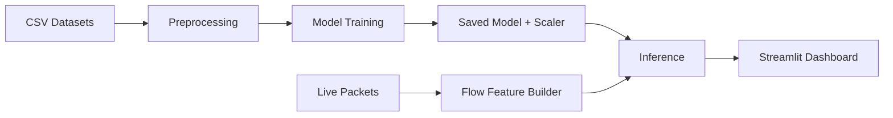

# Real-Time AI Intrusion Detection System (RT-AI IDS)

Production-grade pipeline for **training on benchmark IDS datasets** and **detecting live intrusions in real time** with a Streamlit dashboard.

## Why this project
Network attacks are fast, noisy, and increasingly automated. Traditional IDS rules can’t keep up with evolving patterns. This project combines **data science** (feature engineering, class imbalance handling, evaluation) with **real-time engineering** (packet capture + low-latency inference) to deliver an end‑to‑end, deployable IDS.

## What it does
- Preprocesses CICIDS2017 / NSL‑KDD datasets into a unified, ML‑ready schema.
- Trains a 4‑class deep learning classifier (DOS, Probe, R2L, U2R) with optional BENIGN.
- Captures live packets with Scapy, extracts flow features, and runs inference.
- Visualizes alerts and trends in a Streamlit dashboard.

## Architecture


## Data and Labeling
- **Datasets**: CICIDS2017 and NSL‑KDD.
- **Label mapping**:
  - DOS, Probe, R2L, U2R (attacks)
  - Optional BENIGN / normal traffic
- **Imbalance handling**: SMOTE when available.

## Feature Engineering
- 21 flow‑based features aligned with CICIDS2017 (durations, packet sizes, IAT stats, rates).
- Standardized using `StandardScaler`.

## Model
- Dense MLP: **128 → 64 → 32** with BatchNorm + Dropout
- Softmax output for multi‑class prediction
- Class weighting + early stopping + LR reduction for stability

## Results (local run)
From `models/training_metrics.json`:
- **Test accuracy**: 0.9431  
- **Test loss**: 0.1485  
- **Epochs**: 7  
- **Classes**: BENIGN, DOS, Probe, R2L, U2R

## Repo map
- `setup.py` — create folders
- `requirements.txt` — dependencies
- `src/preprocessor.py` — data loading, scaling, SMOTE, label mapping
- `src/train.py` — model training and artifact saving
- `src/sniffer.py` — live packet capture + feature extraction + inference
- `ui/app.py` — Streamlit dashboard
- `models/training_metrics.json` — training summary

## How to run
**Prereqs**
- Python 3.11 recommended
- On Windows, install **Npcap** to enable live packet capture

**Setup**
```bash
python -m venv .venv
# Windows
.venv\Scripts\activate
# macOS/Linux
source .venv/bin/activate

pip install -r requirements.txt
```

**Preprocess**
```bash
python src/preprocessor.py --data-dir . --profile auto --include-benign --output-dir models
```

**Train**
```bash
python src/train.py --data-dir . --profile auto --include-benign --model-dir models
```

**Run dashboard**
```bash
streamlit run ui/app.py
```

Open http://localhost:8501

## Responsible use
This project is for defensive research, monitoring, and educational use. Do not use it to target systems without explicit authorization.

## Roadmap
- Drift monitoring and recalibration
- Feature alignment for additional datasets
- Containerized deployment + CI/CD
